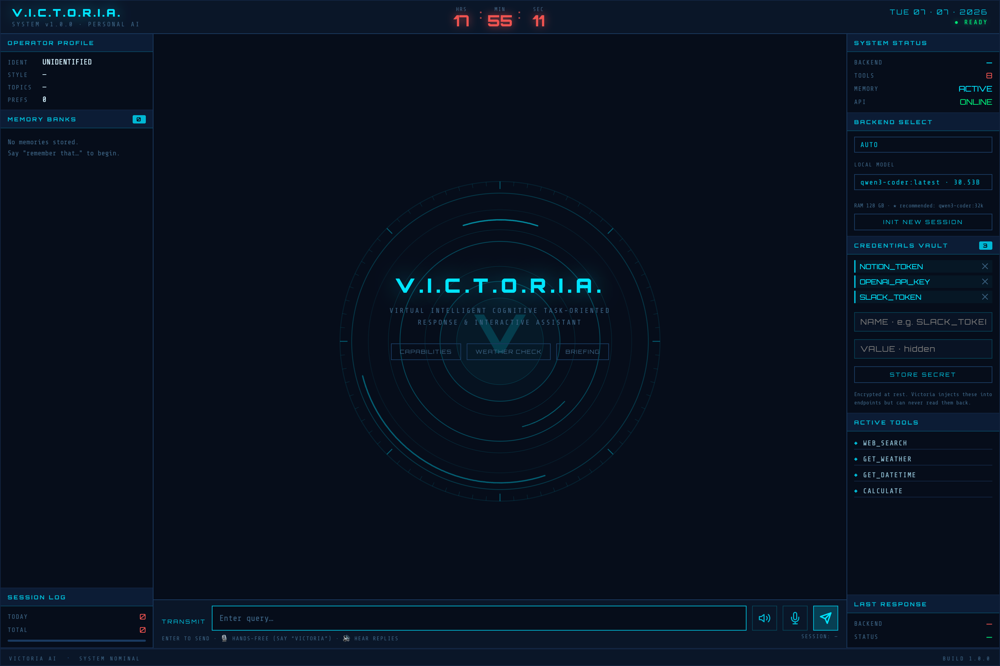
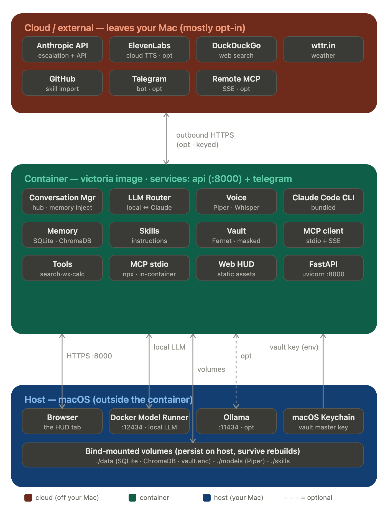
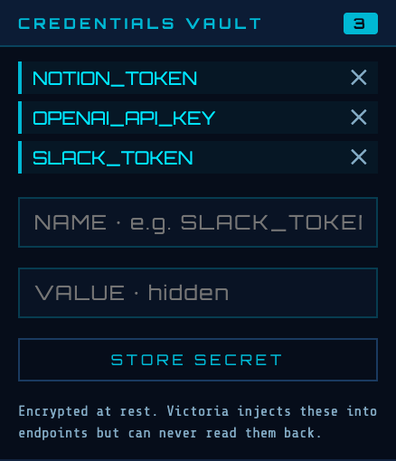
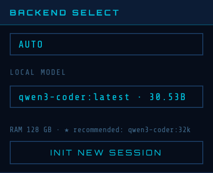

# Victoria AI

A personal Jarvis-style AI assistant — British, witty, and built to learn your style.

Victoria runs on your own hardware, costs nothing by default (local LLM via Docker Model Runner or Ollama), and learns your preferences across every conversation. Talk to her through a web chat UI, Telegram, a terminal, or your voice.



---

## What's in this repo

```
victoria-ai/
├── victoria/
│   ├── config.py               # All settings (env-driven)
│   ├── main.py                 # FastAPI app entrypoint
│   ├── core/
│   │   ├── conversation.py     # Central conversation manager
│   │   ├── llm_router.py       # Routes between Docker/Ollama/Claude backends
│   │   ├── memory.py           # Per-session SQLite conversation history
│   │   ├── semantic_memory.py  # ChromaDB cross-session semantic recall
│   │   ├── user_profile.py     # Persistent user profile (preferences, memories)
│   │   ├── profile_extractor.py# Regex + LLM style learning from conversations
│   │   └── transcription.py    # Whisper speech-to-text
│   ├── interfaces/
│   │   ├── api.py              # REST API (chat, stream, history, profile) — /v1 prefix
│   │   └── telegram_bot.py     # Telegram bot interface
│   ├── static/                 # JARVIS-style HUD web interface (HTML/CSS/JS)
│   ├── tools/
│   │   ├── registry.py         # Decorator-based tool registry
│   │   ├── web_search.py       # DuckDuckGo search (no API key)
│   │   ├── weather.py          # wttr.in weather (no API key)
│   │   ├── datetime_tool.py    # Current date/time with timezone
│   │   ├── calculator.py       # Safe AST-based math evaluator
│   │   └── skills_tools.py     # Skill use/save/list/delete tools
│   ├── skills/
│   │   ├── store.py            # SkillStore — Markdown skill files (CRUD)
│   │   └── importer.py         # Fetch + discover skills from a GitHub repo/URL
│   ├── mcp/
│   │   └── manager.py          # MCP client — connect servers, expose their tools
│   ├── vault/
│   │   └── store.py            # Encrypted credentials vault (inject, never reveal)
│   └── voice/
│       ├── conversation.py     # Voice session loop
│       ├── wake_word.py        # "Hello Victoria" wake word detection
│       ├── audio.py            # Microphone capture + silence detection
│       └── tts/
│           ├── piper_tts.py    # Local Piper TTS (free)
│           └── elevenlabs_tts.py # ElevenLabs TTS (paid, near-human)
├── scripts/
│   ├── chat.py                 # Terminal chat client
│   ├── run_telegram.py         # Telegram bot runner
│   ├── run_voice.py            # Voice interface runner
│   ├── start.sh                # Native launcher — self-heals the Model Runner, Claude-auth preflight, then starts the server
│   ├── update.sh               # One-command native updater
│   ├── ensure-model-runner.sh  # Re-bind the Docker Model Runner host-TCP port if it drops
│   └── claude-login.sh         # Authenticate Claude escalation (subscription login or token)
├── skills/                     # Bundled skills (email-drafter, meeting-summariser, code_reviewskill)
├── tests/                      # 278 pytest tests
├── setup-victoria-mac.sh       # One-command macOS installer
├── docker-compose.yml
├── Dockerfile
├── requirements.txt
└── .env.example
```

---

## How Victoria works

```
┌─────────────────────────────────────────────────┐
│              Interfaces                          │
│   Web UI  ·  Telegram  ·  Voice  ·  Terminal    │
└──────────────────────┬──────────────────────────┘
                       │
          ┌────────────▼────────────┐
          │   Conversation Manager  │
          │  • User profile inject  │
          │  • Semantic recall      │
          │  • Tool routing         │
          │  • Session memory       │
          └────────────┬────────────┘
                       │
          ┌────────────▼────────────┐
          │       LLM Router        │
          │  Docker Model Runner    │
          │  Ollama  ·  Claude API  │
          └─────────────────────────┘
```

**Memory layers (layered, always on):**
1. **Session memory** — full conversation history within a session (SQLite)
2. **Semantic memory** — ChromaDB vector search across all past sessions; relevant context surfaces automatically
3. **User profile** — persistent preferences, style, and explicit memories injected into every system prompt

### Deployment topology — inside vs outside the container

The diagram below is the **containerised** (docker-compose) layout. Running natively
(uvicorn in a venv) is identical externally — "the container" is just the Python
process instead; the connection points are the same.

<p align="center">
  
</p>

**Inside the container** — the whole app ships in one image (two services off it:
`victoria-api` on `:8000` and the optional `victoria-telegram`). Everything needed to
*think, speak, and hear locally* is inside: FastAPI, the LLM router, memory
(SQLite + ChromaDB), skills, the vault, the MCP client, local tools, **Piper** (TTS)
and **Whisper** (STT), any **stdio MCP servers** (spawned in-container via `npx`), and
the **bundled Claude Code CLI**. No GPU, nothing photoreal.

**Crosses the boundary but stays on your Mac (local, no cloud):**
- **Browser → `127.0.0.1:8000`** — HTTP/SSE. Bound to loopback only; the API has no auth, so it's never exposed to the LAN.
- **Container → Docker Model Runner** at `model-runner.docker.internal` (host Docker Desktop, `:12434`) — your local LLM. The primary dependency; never leaves the machine.
- **Container → Ollama** `host.docker.internal:11434` — optional alternate local LLM.
- **macOS Keychain → container** — the vault master key is injected as `VICTORIA_VAULT_KEY` at launch (never written to `.env`); the vault's plaintext secrets never cross back out.
- **Bind mounts** — `./data` (`victoria.db` + ChromaDB + `vault.enc`), `./models` (Piper), `./skills`. Persist on the host, survive rebuilds.

**Cloud connection points (these leave your Mac — mostly opt-in):**
- **Anthropic API** — only on **escalation** (your "yes"), via the bundled Claude CLI (`CLAUDE_CODE_OAUTH_TOKEN`) or the `claude` backend (`ANTHROPIC_API_KEY`).
- **DuckDuckGo** + **wttr.in** — hit only when the web-search / weather tools fire (HTTPS, no key).
- **GitHub** — only during on-demand skill import.
- **ElevenLabs** — only if `TTS_ENGINE=elevenlabs`; otherwise Piper runs fully local.
- **Remote MCP (SSE)** — only if you list remote servers in `mcp.json`.
- **Telegram** — only if the telegram service is running.

**Default privacy posture:** with a local model, Piper TTS, and no remote MCP/Telegram, **nothing leaves your Mac** unless you explicitly escalate to Claude or invoke a cloud-backed tool. Every cloud edge is opt-in or action-triggered.

### Skills (reusable instructions she can apply and create)

Skills are named, reusable instruction sets — Markdown files in `skills/` — that Victoria applies when relevant and that you can ask her to create. They contain **instructions only** (no code), and persist across sessions so they accumulate over time.

- **Use (auto + explicit):** she sees a short index of every skill each turn; when a skill is relevant (you name it, or it matches the request) its full instructions are injected and she follows them. Ships with `email-drafter`, `meeting-summariser`, and `code_reviewskill` (a multi-axis code-review rubric).
- **Create (draft → confirm → save):** *"Create a skill called standup-update that formats my day into Yesterday / Today / Blockers."* She drafts the name, description, and steps, shows them, and asks — it's saved only after you say **yes**.
- **List / delete:** *"What skills do you have?"* / *"Delete the standup-update skill."*
- **Import from GitHub (review first):** *"Import skills from https://github.com/you/skills-repo"* → she shallow-clones the repo, finds skill files, and lists what she found **without saving anything**. You then reply `add all`, `add <name>`, `show <name>` (to read its full instructions first), or `no`. Imported skills are namespaced under `skills/imported/<repo>/` and never overwrite a skill you already have. Works with both flat `*.md` skills and the Claude/Anthropic `skill-name/SKILL.md` folder format; single-file URLs (`.../blob/.../thing.md`) work too.

Skills stay on the local model (they never escalate to the cloud), and creation uses a structured draft the app parses — no reliance on flaky tool-calling. Edit any skill by hand in `skills/*.md`.

**Version & ship your skills.** Skills live in `skills/` in the repo dir — committed skills are baked into the Docker image and mounted at runtime, so anything you create persists across rebuilds and ships to every install once you `git add skills/<name>.md`. Imported skills land in `skills/imported/` and are **git-ignored by default** (they're other people's — keep only your curated ones under version control).

> **Trust note:** an imported skill is text that gets injected into Victoria's prompt and followed, so only import from repositories you trust — the review step (and the fact that skills are instructions-only, never executed code) is your safeguard.

### Credentials vault (secrets she uses but can't read)

Victoria can hold API tokens/keys and inject them into endpoints **without ever knowing their values**. The vault is one-way from her side: values go in, and are only ever resolved at the transport edge — never in her prompt, tool calls, results, logs, or the API.




- **Encrypted at rest** (Fernet) under a master key kept in the **macOS Keychain** (falls back to `VICTORIA_VAULT_KEY` or a `0600` key file). The store is `data/vault.enc` (git-ignored).
- **Add/manage** secrets from the **Credentials Vault** panel in the web HUD — the value is typed into a masked field and posted straight to the vault (never through chat). The panel only ever lists **names**, each with a delete button; values are never shown.
- **Use** a secret by referencing it in `mcp.json` (or any server config): `"env": { "GITHUB_TOKEN": "${vault:GITHUB_TOKEN}" }` or `"headers": { "Authorization": "Bearer ${vault:SLACK_TOKEN}" }`. It's resolved to the real value only as it's handed to the server.
- **API:** `POST /v1/vault` (store), `GET /v1/vault` (names only), `DELETE /v1/vault/{name}`. None return a plaintext value.

> Write-only by design: there is no operation — for Victoria or anyone reading her — that hands a stored value back. So she can authenticate to your services without being able to leak the credentials.

### MCP servers (connect external tools)

Victoria is an **MCP client** — she can use tools from any [Model Context Protocol](https://modelcontextprotocol.io) server you configure, alongside her built-in tools and skills. Copy `mcp.example.json` to `mcp.json` and list your servers (Claude-Desktop-compatible format):

```json
{
  "mcpServers": {
    "filesystem": {
      "command": "npx",
      "args": ["-y", "@modelcontextprotocol/server-filesystem", "/path/you/allow"],
      "readOnly": true
    }
  }
}
```

- **stdio** (`command`/`args`/`env`) and **remote SSE** (`url`/`headers`) servers are both supported.
- On startup she connects each server, and its tools appear to her as `mcp__<server>__<tool>`. `GET /health` shows what connected.
- **Guardrails, per server:** `disabled` (skip), `allowedTools` (whitelist), and `readOnly` (drops write-ish tools like create/update/delete/send). Every MCP call is logged.
- **Trust:** MCP tools run under *your* credentials, so only add servers you trust. `mcp.json` is git-ignored since it may hold secrets; keep them in the servers' `env`.
- A failing server is logged and skipped — it never blocks startup.

**Web reads (real-time info):** enable the bundled `fetch` server (`mcp-server-fetch`) so Victoria can read web pages — paired with her built-in DuckDuckGo search, that's search → read, which covers most "what's happening now" questions without escalating to the cloud. It needs `uv`/`uvx`; if `uvx` isn't on your machine, `pip install mcp-server-fetch` into the app's venv and set the server's `command` to `<your .venv>/bin/python` with `args: ["-m", "mcp_server_fetch"]`.

> Tip: keep the exposed tool set small. A small local model can get lost among dozens of tools; complex multi-tool work is more reliable on the Claude backend.

### Local-first escalation (ask before going to the cloud)

Victoria always tries the **local model first**, and **her tools before that** — `get_weather` for weather, `web_search` + `fetch` for current facts/news/prices, `get_datetime` for the date/time. So most "real-time" questions are answered locally, no cloud needed. Escalation is a **last resort**: only when she genuinely can't answer even with her tools (or a backend error) does she **pause and ask you**:

> *"I'm afraid that one's rather beyond my local wits just now. Shall I put it to Claude for a proper answer? (yes / no)"*

Reply **yes** and she escalates to the **Claude Code CLI** — which uses your existing Claude **subscription**, so no API key is required. Reply **no** (or just ask something else) and nothing leaves your machine. Escalated answers may use read-only web search (`WebSearch`/`WebFetch`) so real-time questions get real answers.

How the local model signals it's stuck: local backends are given an *escalation protocol* in their system prompt and emit a hidden `[ESCALATE]` token, which Victoria intercepts (it never reaches you). Empty replies and backend errors trigger the same offer. Toggle the whole feature with `ESCALATION_ENABLED`; configure it via the `CLAUDE_CLI_*` settings below.

> Requires the [Claude Code CLI](https://claude.com/claude-code) installed and logged in (`claude` on your PATH). Adding ChatGPT as an alternative is a planned follow-up.

### Model tiers (right-size the model to the task)

Victoria can route across three tiers so each request lands on the cheapest model that can do it well:

1. **Everyday / tools → `MODEL_RUNNER_MODEL`** (e.g. `ai/qwen2.5:32k`). An instruct model handles chat, weather, search, and tool use reliably.
2. **Coding / technical → `MODEL_RUNNER_CODE_MODEL`** (e.g. `ai/qwen3-coder:32k`). Set this and coding-flavoured queries auto-route to it; everything else stays on the everyday model. Leave it blank to use one model for everything.
3. **Beyond both → Claude** via the escalation flow above.

Both local tiers run on Docker Model Runner (no cloud). Each reply's badge shows which model answered (e.g. `[DOCKER · qwen3-coder:32k]`), so the routing is visible.

---

## One-command install (macOS)

The fastest path from a fresh Mac to a running Victoria:

```bash
curl -fsSL https://raw.githubusercontent.com/mmaxwell00/victoria-ai/main/setup-victoria-mac.sh | bash
```

The script installs everything it can (Homebrew, Docker Desktop, Model Runner, a local model, Victoria herself in Docker) and is safe to re-run. It also installs a `victoria` command (`start` / `stop` / `status` / `logs` / `update`).

**Secrets stay out of plaintext.** The vault master key and (if set) the Claude token are stored in the **macOS Keychain**, and the `victoria` command injects them into the container at launch — they're never written to `.env`. So launch/manage Victoria with `victoria start` (not a bare `docker compose up`, which wouldn't have the secrets).

macOS only makes you do three things it won't let any script do:

1. **Type your password** when Homebrew / Docker Desktop install
2. **Click OK** on the Xcode Command Line Tools and Docker first-run dialogs
3. **Approve the microphone prompt** in your browser (voice features only)

Options: `--model <name>` to choose the local model, `--claude-token <token>` to enable cloud escalation (get one with `claude setup-token`), `--with-voice` for the native voice runner, `--dir <path>` for a custom location.

Escalation note: the Docker image bundles the Claude Code CLI (plus `git` + `ffmpeg`, so skill import and browser-voice transcription also work in the container). Escalation turns on once a token is stored — via the installer, or later with `./setup-victoria-mac.sh --claude-token "$(claude setup-token)"` then `victoria start`. The token lands in the Keychain, not `.env`.

Prefer to set things up by hand? Read on.

---

## Prerequisites

**Platform:** macOS (native). The core install (Python + Docker) gets you chat, skills, and the credentials vault; the rest unlock specific features.

| Tool | Needed for | Install |
|------|-----------|---------|
| **Python 3.11+** | Core — required | `brew install python@3.11` |
| **Docker Desktop** (+ Model Runner) | Local LLM — required | [docker.com/products/docker-desktop](https://www.docker.com/products/docker-desktop) |
| **Git** (Xcode Command Line Tools) | Cloning + GitHub skill import | `xcode-select --install` |
| **Node.js** | MCP servers launched via `npx` (e.g. filesystem, GitHub) | `brew install node` |
| **Claude Code CLI** | Escalating to Claude (uses your subscription — no API key) | [claude.com/claude-code](https://claude.com/claude-code), then run `claude` once to log in |
| **ffmpeg** | Voice: speech-to-text (Whisper) | `brew install ffmpeg` |
| **PortAudio** | Voice: terminal mic / wake word (browser voice doesn't need it) | `brew install portaudio` |

> The credentials vault's master key uses the **macOS Keychain** automatically — no setup. Voice also needs the Piper model downloaded (see [Voice interface](#voice-interface)).

---

## Installation

### 1. Clone the repo

```bash
git clone https://github.com/mmaxwell00/victoria-ai.git
cd victoria-ai
```

### 2. Create a virtual environment

```bash
python3 -m venv .venv
source .venv/bin/activate
```

### 3. Install dependencies

```bash
pip install -r requirements.txt
```

### 4. Configure environment

```bash
cp .env.example .env
```

Open `.env` and set at minimum:

```bash
# Use Docker Model Runner (built into Docker Desktop) — free, no API key
DEFAULT_LLM=docker
MODEL_RUNNER_MODEL=ai/qwen2.5:latest

# Optional: add your Anthropic key to unlock Claude as a fallback
ANTHROPIC_API_KEY=sk-ant-...
```

### 5. Pull a local model

Victoria uses Docker Desktop's built-in Model Runner. Enable it first:

> Docker Desktop → Settings → Features in development → **Docker Model Runner** → Apply & Restart

Then pull a model:

```bash
docker model pull ai/qwen2.5         # recommended — follows the escalation protocol reliably
# or
docker model pull ai/llama3.2        # ~2GB, lighter, but over-escalates more often
```

> **Model choice matters for escalation.** Victoria decides when to hand off to Claude by having the local model emit a hidden signal (see [Local-first escalation](#local-first-escalation-ask-before-going-to-the-cloud)). `ai/qwen2.5` follows that instruction well; very small models (e.g. `llama3.2:3B`) tend to over-escalate.

Verify it's running:

```bash
curl http://localhost:12434/engines/llama.cpp/v1/models
```

### 6. Optional — enable the extra features

```bash
# Escalation to Claude (uses your Claude subscription, no API key):
claude            # run once to log in; Victoria calls the CLI on your "yes"

# MCP servers (filesystem, GitHub, …) — needs Node.js on PATH:
cp mcp.example.json mcp.json    # then edit to list the servers you want
```

The credentials vault needs no setup — add secrets from the **Credentials Vault** panel in the HUD once it's running.

---

## Running Victoria

### Web chat UI (JARVIS-style HUD)

```bash
uvicorn victoria.main:app --reload
```

Open **http://localhost:8000** in your browser.

> After a reboot, prefer `scripts/start.sh` — it re-binds the Docker Model Runner (whose host-TCP port can drop when Docker/the Mac restarts, emptying the model dropdown) before launching. See [Starting & restarting](#starting--restarting).

The interface is a full-screen dark HUD inspired by the Iron Man JARVIS OS — dark navy background, teal panel headers, red digit clock, and a rotating arc reactor ring as the chat backdrop.

**Left sidebar**
- Operator profile — your name, how she should address you, learned communication style, preference count. On first run a one-time **"Identify Operator"** modal asks your name and how you'd like to be addressed
- Memory banks — live list of all stored explicit memories
- Topics — your chat history: each past conversation, newest first; click one to reopen it. Starting a new chat archives the current one here
- Session log — today's and total session counts with a fill bar

**Center**
- Rotating V.I.C.T.O.R.I.A. arc reactor ring (glows and pulses while thinking)
- Chat messages overlaid on the ring — `OPERATOR` / `VICTORIA` labels with `HH:MM:SS` timestamps
- Each response gets a backend badge: `[DOCKER]`, `[OLLAMA]`, or `[CLAUDE]`

**Right sidebar**
- System status — active backend, tool count, memory status, API health
- Backend selector (Auto / Docker Model Runner / Ollama / Claude)
- **Local model selector** — pick which pulled Docker Model Runner model to use, switched **live** (no restart) and persisted to `.env`. It lists everything `docker model ls` has, and **★-marks a recommendation for your RAM** (detected via `sysctl`) — e.g. a 7B on a 16 GB machine, a 30B on 64 GB, a 70B on 128 GB. Backed by `GET /v1/models` + `POST /v1/models/select`.
- Credentials Vault (see below)
- Active tools list
- Last response status




**Talk to her (voice in the browser)**

The composer has two extra controls next to **Send**:
- 🎙 **Mic** — click to start recording, click again to stop. Your speech is transcribed (Whisper) and sent as a message; replies to voice input are spoken back automatically.
- 🔊 **Speaker** — toggle to have *every* reply read aloud, not just answers to voice input.

Voice runs through two endpoints — `POST /v1/transcribe` (audio → text) and `POST /v1/tts` (text → audio) — using the same Whisper + Piper/ElevenLabs stack as the terminal voice interface. It needs the **Piper voice model** downloaded (see [Voice interface](#voice-interface) below) and `python-multipart` (in `requirements.txt`). The mic uses your browser's microphone, so grant permission when prompted; switch to a natural cloud voice by setting `TTS_ENGINE=elevenlabs` (see config).

### Terminal chat

```bash
python scripts/chat.py
```

Type `claude`, `ollama`, or `docker` during a session to switch backends on the fly. Type `quit` to exit.

### Telegram bot

**One-time setup:**
1. Message `@BotFather` on Telegram → `/newbot`
2. Follow the prompts, copy the token
3. Add to `.env`: `TELEGRAM_BOT_TOKEN=your_token_here`

```bash
python scripts/run_telegram.py
```

**Telegram commands:**

| Command | What it does |
|---------|-------------|
| `/start` | Wake Victoria up |
| `/new` | Start a fresh conversation |
| `/remember <text>` | Store a persistent memory |
| `/forget <text>` | Remove a memory (exact match) |
| `/profile` | See everything Victoria knows about you |
| `/backend docker\|ollama\|claude` | Switch AI brain for this session |
| `/help` | Full command list |

Voice notes are transcribed automatically via Whisper.

### Voice interface

> Requires PortAudio (`brew install portaudio`) and the Piper voice model (see below).

**Download the Piper voice model (~65 MB):**

```bash
mkdir -p models && cd models
curl -LO https://huggingface.co/rhasspy/piper-voices/resolve/main/en/en_GB/jenny_dioco/medium/en_GB-jenny_dioco-medium.onnx
curl -LO https://huggingface.co/rhasspy/piper-voices/resolve/main/en/en_GB/jenny_dioco/medium/en_GB-jenny_dioco-medium.onnx.json
cd ..
```

**Start the voice interface:**

```bash
python scripts/run_voice.py
```

Say **"Hello Victoria"** to activate. She'll respond with voice. The session stays open for 30 seconds of silence before returning to wake-word mode. Say "goodbye" to end the session immediately.

If a microphone isn't detected, it falls back to press-Enter mode automatically.

### Docker Compose (API + Telegram together)

```bash
docker compose up --build
```

This starts:
- `victoria-api` on port 8000 (web UI + REST API)
- `victoria-telegram` (Telegram bot)

Both containers connect to Docker Model Runner on the host via `model-runner.docker.internal`.

---

## Starting & restarting

**Native setup** — one command starts (or restarts) Victoria:

```bash
~/victoria-ai/scripts/start.sh
```

This first **self-heals the Docker Model Runner** — its host-TCP port (`:12434`)
can silently drop when Docker Desktop or the Mac restarts, which empties the
model dropdown; `start.sh` detects that and re-binds it before launching. Then
it starts the server and health-checks it. Use this after every reboot.

**Claude login (for escalation).** On startup, `start.sh` also reports whether
Claude escalation is authenticated. The local model works regardless — this only
enables "ask Claude when the local model is stuck," using your Claude
**subscription** (no API key). If it isn't logged in, run:

```bash
~/victoria-ai/scripts/claude-login.sh
```

and pick **subscription login** (one-time) or a **long-lived token** (written to
`.env` as `CLAUDE_CLI_OAUTH_TOKEN` — best for an always-on server, since it
doesn't expire and works no matter how Victoria was launched). Then re-run
`start.sh`.

## Updating

**Native setup** — one command pulls the latest, refreshes deps, re-binds the
Model Runner, restarts, and health-checks:

```bash
~/victoria-ai/scripts/update.sh
```

Your `.env`, `data/` (memory + vault), and `skills/` are left untouched. Then hard-refresh the browser tab (`Cmd + Shift + R`) to pick up any HUD changes.

**Docker setup** — `victoria update` (rebuilds the image and restarts).

---

## Configuration reference

All settings are in `.env` (copy from `.env.example`).

| Variable | Default | Description |
|----------|---------|-------------|
| `DEFAULT_LLM` | `docker` | Primary backend: `docker`, `ollama`, or `claude` |
| `MODEL_RUNNER_URL` | `http://localhost:12434/engines/llama.cpp/v1` | Docker Model Runner endpoint |
| `MODEL_RUNNER_MODEL` | `ai/qwen2.5:latest` | Model to use with Docker Model Runner |
| `OLLAMA_BASE_URL` | `http://localhost:11434` | Ollama endpoint (if using Ollama) |
| `OLLAMA_MODEL` | `llama3.1` | Ollama model name |
| `ANTHROPIC_API_KEY` | _(empty)_ | Anthropic key for Claude fallback |
| `CLAUDE_MODEL` | `claude-sonnet-4-6` | Claude model ID |
| `COMPLEX_QUERY_THRESHOLD` | `200` | Word count above which queries escalate to Claude |
| `ESCALATION_ENABLED` | `true` | Try local first; ask before escalating to Claude when it can't answer |
| `CLAUDE_CLI_COMMAND` | `claude` | Claude Code CLI binary used for escalation (uses your subscription) |
| `CLAUDE_CLI_MODEL` | `sonnet` | Model alias/id for the Claude Code CLI |
| `CLAUDE_CLI_TIMEOUT` | `120` | Seconds before a CLI escalation call is aborted |
| `CLAUDE_CLI_ALLOWED_TOOLS` | `WebSearch WebFetch` | Read-only tools Claude may use non-interactively when answering |
| `TTS_ENGINE` | `piper` | TTS backend: `piper` (free) or `elevenlabs` (paid) |
| `ELEVENLABS_API_KEY` | _(empty)_ | ElevenLabs key (only if `TTS_ENGINE=elevenlabs`) |
| `WAKE_WORD` | `hello victoria` | Voice activation phrase |
| `VOICE_SESSION_TIMEOUT` | `30` | Seconds of silence before returning to wake-word mode |
| `TELEGRAM_BOT_TOKEN` | _(empty)_ | Token from @BotFather |
| `SKILLS_PATH` | `skills` | Directory of Markdown skill files Victoria can apply and create |
| `DB_PATH` | `data/victoria.db` | SQLite database (conversation history + user profiles) |
| `CHROMADB_PATH` | `data/chromadb` | ChromaDB directory (semantic memory) |

---

## How Victoria learns your style

Victoria builds a persistent profile per user that gets injected into her system prompt before every response.

**Explicit memories** — stored instantly via regex, zero latency:
```
"remember that I prefer bullet points"
"note that I prefer metric units"
"don't forget I work primarily in Python"
"fyi, I like concise answers"
```

**Implicit style learning** — runs silently in the background every 5 turns:
After each 5th message, Victoria analyses the conversation with the LLM and extracts style signals — preferred response length, topics you keep raising, communication patterns. This fires as a background task and never delays your response.

**Profile in the system prompt** (example):
```
About this user:
The user's name is Alex.
Communication style: direct and technical.
Response preferences:
- prefers bullet points
- wants code examples when relevant
Topics they care about: Python, AI, software architecture.
Things to remember:
- prefers metric units
- prefers dark mode UIs
```

Use `/profile` in Telegram or `GET /v1/profile/{user_id}` via the API to inspect your profile at any time. The web HUD shows your profile, memories, and session stats live in the left sidebar.

---

## REST API

The API runs on port 8000 when you start the app with `uvicorn`.

```bash
# Chat (blocking)
curl -X POST http://localhost:8000/v1/chat \
  -H "Content-Type: application/json" \
  -d '{"message": "What is the weather in London?", "user_id": "alex"}'

# Chat (streaming — Server-Sent Events)
curl -X POST http://localhost:8000/v1/chat/stream \
  -H "Content-Type: application/json" \
  -d '{"message": "Tell me about Python generators", "user_id": "alex"}'

# Force a specific backend for one request
curl -X POST http://localhost:8000/v1/chat \
  -H "Content-Type: application/json" \
  -d '{"message": "Explain quantum entanglement", "user_id": "alex", "backend": "claude"}'

# Conversation history for a session
curl http://localhost:8000/v1/sessions/alex

# User profile (preferences, memories, style)
curl http://localhost:8000/v1/profile/alex

# Speech-to-text — transcribe an audio clip
curl -X POST http://localhost:8000/v1/transcribe -F "audio=@clip.webm"

# Text-to-speech — synthesize speech (saves audio to a file)
curl -X POST http://localhost:8000/v1/tts \
  -H "Content-Type: application/json" \
  -d '{"text": "Good evening."}' --output victoria.wav

# Health check (includes tool count + memory status)
curl http://localhost:8000/health
```

---

## Tech stack

| Layer | Technology |
|-------|-----------|
| API framework | FastAPI + Uvicorn |
| Local LLM | Docker Model Runner / Ollama |
| Cloud LLM | Anthropic Claude (Sonnet 4.6) |
| Speech-to-text | faster-whisper (local) |
| Text-to-speech | Piper (local) / ElevenLabs (cloud) |
| Wake word | openWakeWord |
| Telegram | python-telegram-bot |
| Session memory | SQLite |
| Semantic memory | ChromaDB (embedded) |
| User profiles | SQLite |
| Web search tool | DuckDuckGo (no API key) |
| Containerisation | Docker Compose |

---

## Troubleshooting

**Chat returns `502` / logs show `model not found` (404 from the Model Runner)**
`MODEL_RUNNER_MODEL` must match an id from `docker model ls` *exactly*, including
any tag. Pulling `ai/llama3.2` can resolve to a tagged id such as
`ai/llama3.2:3B-Q4_K_M` — in that case set `MODEL_RUNNER_MODEL` to the full id.

```bash
docker model ls                                            # see the exact id
curl http://localhost:12434/engines/llama.cpp/v1/models    # or query the runner
```

**Model dropdown is empty / "no models pulled" (but `docker model ls` shows models)**
The Model Runner's host-TCP port dropped — usually after a Docker Desktop or Mac
restart. The runner still runs internally, but `:12434` isn't bound, so the app
can't reach it. Re-bind it (or just run `scripts/start.sh`, which does this
automatically):

```bash
~/victoria-ai/scripts/ensure-model-runner.sh
# or, by hand:
docker desktop disable model-runner && docker desktop enable model-runner --tcp=12434
```

Then hard-refresh the tab (`Cmd + Shift + R`).

**Escalation to Claude fails with `401` / "Invalid authentication credentials"**
The Claude Code CLI is being routed away from your subscription login by
environment variables inherited from the shell Victoria was launched in — most
commonly a gateway `ANTHROPIC_BASE_URL` and `CLAUDECODE`/`CLAUDE_CODE_*` markers
injected when you start the server from *inside* another Claude Code / Agent SDK
session. Victoria now scrubs these for the `claude -p` subprocess, but for a
clean setup:

- **Most reliable fix — use an explicit token.** Run `claude setup-token`, then
  put it in `.env` as `CLAUDE_CLI_OAUTH_TOKEN=...` and restart. Victoria injects
  it for the `claude -p` subprocess, so escalation authenticates regardless of
  how or where the server was launched. (First run `claude -p "hi"` in your
  terminal to confirm the login itself works.)
- Or start Victoria from a **normal terminal** (Terminal.app) where `claude` is
  logged in, not from within another Claude Code session:
  `~/victoria-ai/scripts/start.sh`. Run `claude` once interactively to refresh
  the login if needed.
- Escalation uses your Claude **subscription** (never `ANTHROPIC_API_KEY`); in
  Docker it uses `CLAUDE_CODE_OAUTH_TOKEN`.

**`pip install` fails with `In --require-hashes mode, all requirements must have their versions pinned`**
Your environment (a `pip.conf` or `PIP_REQUIRE_HASHES` env var) enforces hashed,
fully-pinned installs, which `requirements.txt` does not provide. For a one-off
install without changing your global config:

```bash
PIP_REQUIRE_HASHES=false pip install -r requirements.txt
```

---

## Running the tests

```bash
python3 -m pytest tests/ -v
```

278 tests across memory & semantic recall, conversation, tools & tool-calling, local-first escalation, skills & GitHub import, MCP, the credentials vault, model selection, voice (transcribe / TTS / wake-word), Telegram, user profiles, and API layers.
