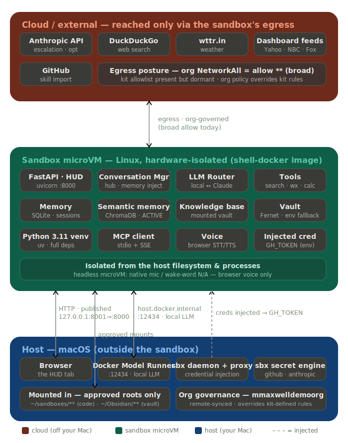

# Victoria in a Docker Sandbox (sbx)

Run Victoria as a **persistent service inside an isolated Docker Sandbox** —
hardware-isolated from the host filesystem/processes — while the heavy local LLM
stays on the host's Docker Model Runner. Tightened egress (an allowlist) and
secret-engine credentials are the **Phase 3** hardening target (see
[`SECURITY-AUDIT.md`](SECURITY-AUDIT.md)); today the sandbox runs on the org's
broad network allow. **Verified working end-to-end (Phase 2 — full dependency set
+ ChromaDB semantic memory).**


*The HUD above is served from inside the sandbox (`127.0.0.1:8001`): chat via the
host Model Runner, the Obsidian knowledge base (mounted vault), and the live
dashboard (weather · markets incl. metals/volume · NBC+Fox headlines).*

## What runs where

<p align="center">
  
</p>

The quick text version:

```
HOST (macOS)                          SANDBOX microVM (Linux, isolated)
  Docker Model Runner  ◀──:12434───     Victoria (uvicorn :8000) ──published──▶ 127.0.0.1:8001
    (host.docker.internal)  host gateway  knowledge base · tools · dashboard
  ~/Obsidian/**  (mounted, per policy) ▶  memory / RAG substrate
  Browser ────────────────────────────▶  the HUD
```

## Quickstart — fresh Mac (start to finish)

**Prerequisites**

- **Apple Silicon Mac, 16 GB+ RAM recommended** — a local LLM lives in RAM (the
  default `ai/qwen2.5` is ~4–5 GB), plus a few GB of disk for the image, the
  Python 3.11 venv, and the voice model.
- **Homebrew**, **git**, and **Docker Desktop** (a recent version with Model
  Runner), installed and running.

**Steps**

```bash
# 1. Tooling (skip any you already have)
brew install --cask docker            # then launch Docker Desktop once
brew install docker/tap/sbx
sbx login                             # sign in (required where sandboxes are org-governed)

# 2. Host Model Runner + a model (pull the tag MODEL_RUNNER_MODEL names in sbx/spec.yaml)
docker desktop enable model-runner --tcp=12434
docker model pull ai/qwen2.5:32k

# 3. Clone the repo (this is where you run the deploy from)
git clone https://github.com/mmaxwell00/victoria-ai.git ~/victoria-ai && cd ~/victoria-ai

# 4. Deploy — stages code + the Piper voice model, packs the kit, runs it, publishes the HUD.
#    Point it at your Obsidian vault if you have one (optional; omit to run without the KB):
VAULT_PATH="$HOME/Obsidian/AI/AI-Victoria" ./deploy-sandbox.sh

# 5. Open the HUD — use 127.0.0.1, NOT localhost (localhost resolves to ::1 and resets)
open http://127.0.0.1:8001
```

First run is slow (a few minutes — it builds the venv and installs the full
dependency set). Verify with `curl -4 -sS http://127.0.0.1:8001/health` (expect
`"status":"ok"`, `"semantic_memory":true`).

**Mount policy.** `deploy-sandbox.sh` mounts `~/sandboxes/victoria-ai` (staged
code) and your vault path. Where sandboxes are **org-governed** (e.g. Docker's
`mmaxwelldemoorg`), an admin must allow-list those roots in Docker Home —
**case-sensitive** (`~/Obsidian/**`, capital O); a denied mount surfaces as
`403 mount policy denied`. On an un-governed/personal setup, home subfolders are
generally allowed.

**No per-user edits needed.** sbx mounts a host path at that same absolute path
inside the sandbox, so the kit's repo/vault paths are host-specific — but
[`sbx/spec.yaml`](sbx/spec.yaml) keeps them as `__VICTORIA_REPO__` /
`__VICTORIA_VAULT__` placeholders that the deploy script substitutes at pack time.
Override any default via env: `SBX_NAME`, `REPO_STAGE`, `VAULT_PATH`, `HOST_PORT`.
(`sbx login`, escalation via `sbx secret set -g anthropic`, and voice being
browser-based are covered below and in the gotchas.)

## Verified working (Phase 2)

| Capability | Status |
|---|---|
| HUD + `/health` (browser-reachable via `127.0.0.1:8001`) | ✅ |
| Chat — local LLM via the **host Model Runner** (`host.docker.internal:12434`) | ✅ |
| Obsidian **knowledge base** (mounted vault → memory/RAG) | ✅ |
| Dashboard — weather · markets (stocks + Gold/Silver + S&P/NASDAQ volume) · NBC+Fox | ✅ |
| Egress for tools/dashboard | ✅ |
| **Semantic memory (ChromaDB)** | ✅ (Phase 2 — uv-managed Python 3.11 venv) |
| Voice — browser (Whisper STT + Piper TTS) | ✅ · native mic/wake-word N/A in a headless sandbox (no audio device) |

## Gotchas (all real, learned the hard way)

- **Kits are packed artifacts.** `sbx kit pack sbx/` → ZIP; a raw YAML won't run.
- **Agent name = kit name.** `sbx run --kit … victoria <paths>`.
- **Model Runner is `host.docker.internal:12434`**, not `localhost` (localhost is the sandbox itself).
- **A service goes in `commands.startup` (`background: true`), not the entrypoint** — the entrypoint is the interactive agent and dies on detach. Bind `--host 0.0.0.0`.
- **IPv4-only.** Publish/curl via `127.0.0.1`; `localhost` → `::1` resets the connection.
- **Mounts are org-governed and case-sensitive.** Code under `~/sandboxes/**`; the vault rule must match the folder's exact case (`~/Obsidian/**`, capital O).
- **The sandbox filesystem is per-instance** — `sbx rm` + recreate wipes installed deps, so they're baked into the kit's `install`.
- **`startup` can race `install` — in two places.** On first boot the startup
  service may fire before `install` is done, and there are two distinct traps:
  (1) before `uv venv` runs, `/home/agent/venv/bin/python` is a dangling symlink →
  `python: not found`; (2) after `uv venv` but before `uv pip install` finishes, the
  interpreter runs but its packages don't → `No module named uvicorn`. Either way
  uvicorn dies, the service is down, and `/health` connection-resets. The kit's
  startup command now **blocks until the app itself imports**
  (`python -c 'import uvicorn, victoria.main'`, bounded ~6 min) — the real
  precondition for `uvicorn victoria.main:app` — before launching. Gating on the
  interpreter alone is *not* enough; it clears while pip is still installing.
  If a running sandbox is ever wedged this way the venv is already built — relaunch
  the service from the kit (redeploy) rather than `sbx exec`-ing it (exec-started
  procs aren't the supervised service).
- **The Piper voice model isn't in the clone.** `models/*.onnx` is large and
  gitignored, so the staged clone (and thus the sandbox) doesn't get it — and
  `/v1/tts` then 503s (`Piper model not found`): Victoria hears you (Whisper STT)
  but can't speak. `deploy-sandbox.sh` now stages `models/en_GB-jenny_dioco-medium.onnx`
  into `$REPO_STAGE/models` (copy from a native checkout, else download from Hugging
  Face). It lands in the mounted repo, so it survives `sbx rm` and needs staging only
  once. Pip won't rebuild it; the fix is purely getting the file in place.

## Isolation & credentials

- **Egress (Q2):** the kit ships a `network.allowedDomains` allowlist, but it is
  **inert by decision** — the org `NetworkAll` (`allow **`) overrides kit rules, so
  a non-allowlisted host is still reachable (verified). sbx egress governance is
  **org/team-scoped, not per-sandbox**, so hardening only Victoria isn't possible;
  the sole lever is tightening the org-wide `NetworkAll` (Docker Home), which flips
  *every* sandbox to default-deny. We chose to leave egress broad — the sandbox's
  hardware isolation is the security property we wanted. See
  [`SECURITY-AUDIT.md`](SECURITY-AUDIT.md).
- **Credentials (Q3):** use the **sbx credential engine** (`sbx secret set`) — the
  proxy injects creds without the value entering the VM as plaintext-at-rest.
  Empirically, the `github` service secret lands in the sandbox as env var
  **`GH_TOKEN`**; Victoria's vault `resolve()` now falls back to `os.environ`, so a
  `${vault:GH_TOKEN}` reference resolves with no config change. (The sbx `anthropic`
  service secret is scoped to sbx's own `claude` agent — it is **not** injected into
  the `victoria` sandbox, so it does not authenticate Victoria's escalation; see next.)
- **Claude escalation (the "Claude" backend):** Victoria escalates by shelling out
  to the **Claude Code CLI** (`claude -p`, subscription auth — not the API). The kit
  installs the CLI (`npm i -g @anthropic-ai/claude-code`); auth is a long-lived token
  you generate once on the host:

  ```bash
  claude setup-token                                   # prints a token
  mkdir -p ~/.victoria && pbpaste > ~/.victoria/claude-oauth-token   # or paste it in
  ./deploy-sandbox.sh                                  # picks it up, injects it (never committed)
  ```

  The deploy script reads `$CLAUDE_CODE_OAUTH_TOKEN` (or `~/.victoria/claude-oauth-token`)
  and substitutes it into the packed kit as `CLAUDE_CLI_OAUTH_TOKEN`, which Victoria
  injects as `CLAUDE_CODE_OAUTH_TOKEN` for the `claude` subprocess. No token → the
  "Claude" backend is unavailable and the local model answers (no hard error).

## Roadmap

- **Phase 2 — done.** The kit installs the full dependency set on a **uv-managed
  Python 3.11 venv** (uv ships in the shell-docker image), so ChromaDB (semantic
  memory) is active and the Whisper/Piper voice deps install. *Gotcha:* the `uv`
  install steps must run as the **agent user (`user: "1000"`)** so the venv +
  interpreter are agent-executable; and `sounddevice`/PortAudio can't initialise
  in a headless sandbox (native mic is out — browser voice is the path).
- **Phase 3 — Q3 done; Q2 deferred.** Q3 (credentials) done: `resolve()` falls back
  to proxy-injected env creds (`GH_TOKEN`). Q2 (egress allowlist) is written into
  the kit but **inert by decision** — sbx egress governance is org/team-scoped (not
  per-sandbox), so the only lever is an org-wide `NetworkAll` tighten that would flip
  every sandbox to default-deny; we chose to leave it broad. If ever pursued, first
  bake deps into a custom image so a tight runtime-only allowlist won't break
  sandbox creation.
