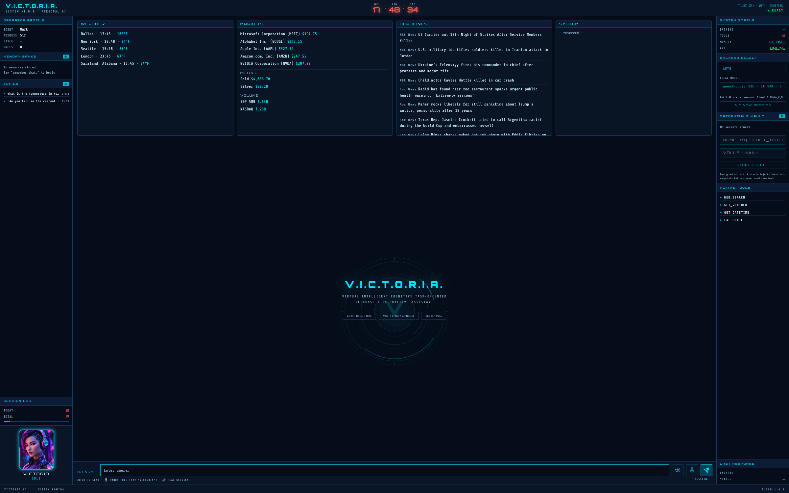

# Victoria in a Docker Sandbox (sbx)

Run Victoria as a **persistent service inside an isolated Docker Sandbox** —
hardware-isolated from the host filesystem/processes, default-deny egress,
credentials proxied in — while the heavy local LLM stays on the host's Docker
Model Runner. **Verified working end-to-end (Phase 1).**



*The HUD above is served from inside the sandbox (`127.0.0.1:8001`): chat via the
host Model Runner, the Obsidian knowledge base (mounted vault), and the live
dashboard (weather · markets incl. metals/volume · NBC+Fox headlines).*

## What runs where

```
HOST (macOS)                          SANDBOX microVM (Linux, isolated)
  Docker Model Runner  ◀──:12434───     Victoria (uvicorn :8000) ──published──▶ 127.0.0.1:8001
    (host.docker.internal)  allowlisted   knowledge base · tools · dashboard
  ~/Obsidian/**  (mounted, per policy) ▶  memory / RAG substrate
  Browser ────────────────────────────▶  the HUD
```

## Prerequisites

- **`sbx`** — `brew install docker/tap/sbx` (macOS) / `winget install Docker.sbx` (Windows)
- **Docker Desktop** + **Model Runner** with host TCP: `docker desktop enable model-runner --tcp=12434`, and a model pulled (`docker model pull ai/qwen2.5`)
- **Mount policy** (this environment is org-governed): a sandbox may only mount
  approved roots. Code is staged under **`~/sandboxes/**`** (allowed); the Obsidian
  vault needs its own filesystem-allow rule for its exact path (e.g. `~/Obsidian/**`).

## Deploy

```bash
./deploy-sandbox.sh          # stages code, packs the kit, runs it, publishes the HUD
open http://127.0.0.1:8001   # use 127.0.0.1 — NOT localhost (resolves to ::1)
```

It packs [`sbx/spec.yaml`](sbx/spec.yaml) (`sbx kit pack`), runs it
(`sbx run --kit … victoria <repo> <vault>`), and publishes the port
(`sbx ports … --publish 127.0.0.1:8001:8000`). The kit header lists the exact commands.

## Verified working (Phase 1)

| Capability | Status |
|---|---|
| HUD + `/health` (browser-reachable via `127.0.0.1:8001`) | ✅ |
| Chat — local LLM via the **host Model Runner** (`host.docker.internal:12434`) | ✅ |
| Obsidian **knowledge base** (mounted vault → memory/RAG) | ✅ |
| Dashboard — weather · markets (stocks + Gold/Silver + S&P/NASDAQ volume) · NBC+Fox | ✅ |
| Egress for tools/dashboard | ✅ |
| **Semantic memory (ChromaDB)** | ✅ (Phase 2 — uv-managed Python 3.11 venv) |
| Voice — browser (Whisper STT + Piper TTS) | ✅ · native mic/wake-word N/A in a headless sandbox (no audio device) |

## Gotchas (all real, learned the hard way)

- **Kits are packed artifacts.** `sbx kit pack sbx/` → ZIP; a raw YAML won't run.
- **Agent name = kit name.** `sbx run --kit … victoria <paths>`.
- **Model Runner is `host.docker.internal:12434`**, not `localhost` (localhost is the sandbox itself).
- **A service goes in `commands.startup` (`background: true`), not the entrypoint** — the entrypoint is the interactive agent and dies on detach. Bind `--host 0.0.0.0`.
- **IPv4-only.** Publish/curl via `127.0.0.1`; `localhost` → `::1` resets the connection.
- **Mounts are org-governed and case-sensitive.** Code under `~/sandboxes/**`; the vault rule must match the folder's exact case (`~/Obsidian/**`, capital O).
- **The sandbox filesystem is per-instance** — `sbx rm` + recreate wipes installed deps, so they're baked into the kit's `install`.
- **`startup` can race `install`.** On first boot the startup service may fire
  before `uv venv` has finished materialising the interpreter, so
  `/home/agent/venv/bin/python` is a momentarily dangling symlink and uvicorn dies
  with `python: not found` (one line in `/tmp/victoria.log`, service down, `/health`
  connection-reset). The kit's startup command now **blocks until the interpreter
  actually runs** (bounded ~5 min) before launching uvicorn. If a running sandbox
  is ever in this state, the venv is already built — relaunch the service from the
  kit (redeploy) rather than `sbx exec`-ing it (exec-started procs aren't the
  supervised service).

## Isolation & credentials

- Network is currently broad (org `NetworkAll` allow). **Phase 3 hardening:** tighten
  `network.allowedDomains` in the kit to just what Victoria uses.
- Secrets: use the **sbx credential engine** (`sbx secret set`) — the proxy injects
  them without the value entering the VM. `github`/`anthropic` are typically already set.

## Roadmap

- **Phase 2 — done.** The kit installs the full dependency set on a **uv-managed
  Python 3.11 venv** (uv ships in the shell-docker image), so ChromaDB (semantic
  memory) is active and the Whisper/Piper voice deps install. *Gotcha:* the `uv`
  install steps must run as the **agent user (`user: "1000"`)** so the venv +
  interpreter are agent-executable; and `sounddevice`/PortAudio can't initialise
  in a headless sandbox (native mic is out — browser voice is the path).
- **Phase 3** — tighten egress to an allowlist (Q2); move Victoria's vault
  secrets to the `sbx secret` credential engine (Q3).
