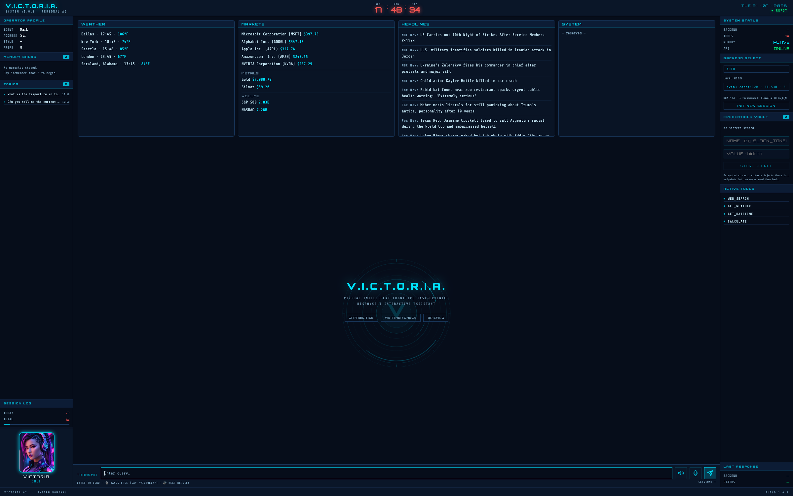
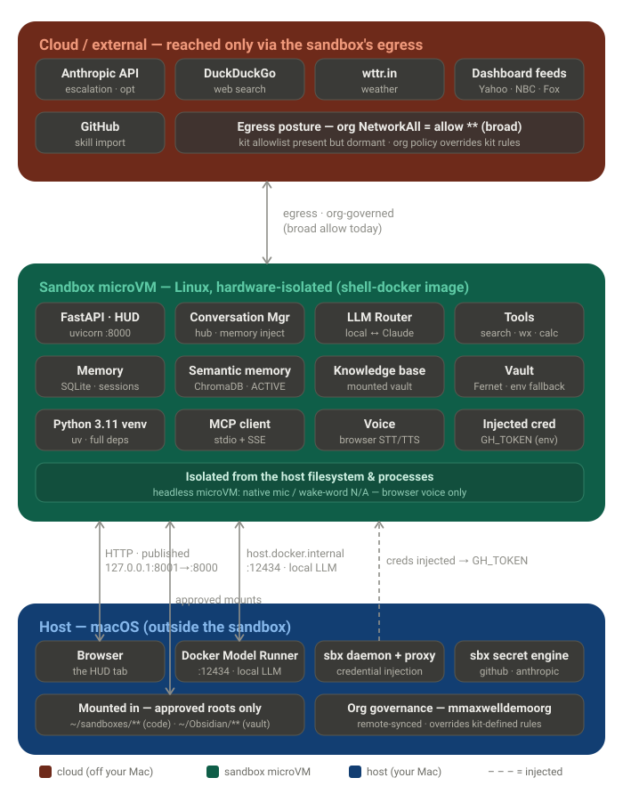

# Victoria in a Docker Sandbox (sbx)

Run Victoria as a **persistent service inside an isolated Docker Sandbox** —
hardware-isolated from the host filesystem/processes — while the heavy local LLM
stays on the host's Docker Model Runner. Tightened egress (an allowlist) and
secret-engine credentials are the **Phase 3** hardening target (see
[`SECURITY-AUDIT.md`](SECURITY-AUDIT.md)); today the sandbox runs on the org's
broad network allow. **Verified working end-to-end (Phase 2 — full dependency set
+ ChromaDB semantic memory).**



*The HUD above is served from inside the sandbox (`127.0.0.1:8001`): chat via the
host Model Runner, the Obsidian knowledge base (mounted vault), and the live
dashboard (weather · markets incl. metals/volume · NBC+Fox headlines).*

## What runs where

<p align="center">
  
</p>

The quick text version:

```
HOST (macOS)                          SANDBOX microVM (Linux, isolated)
  Docker Model Runner  ◀──:12434───     Victoria (uvicorn :8000) ──published──▶ 127.0.0.1:8001
    (host.docker.internal)  host gateway  knowledge base · tools · dashboard
  ~/Obsidian/**  (mounted, per policy) ▶  memory / RAG substrate
  Browser ────────────────────────────▶  the HUD
```

## Quickstart — fresh Mac (start to finish)

**Prerequisites**

- **Apple Silicon Mac, 16 GB+ RAM recommended** — a local LLM lives in RAM (the
  default `ai/qwen2.5` is ~4–5 GB), plus a few GB of disk for the image, the
  Python 3.11 venv, and the voice model.
- **Homebrew**, **git**, and **Docker Desktop** (a recent version with Model
  Runner), installed and running.

**Steps**

```bash
# 1. Tooling (skip any you already have)
brew install --cask docker            # then launch Docker Desktop once
brew install docker/tap/sbx
sbx login                             # sign in (required where sandboxes are org-governed)

# 2. Host Model Runner + a model (pull the tag MODEL_RUNNER_MODEL names in sbx/spec.yaml)
docker desktop enable model-runner --tcp=12434
docker model pull ai/qwen2.5:32k

# 3. Clone the repo (this is where you run the deploy from)
git clone https://github.com/mmaxwell00/victoria-ai.git ~/victoria-ai && cd ~/victoria-ai

# 4. Deploy — stages code + the Piper voice model, packs the kit, runs it, publishes the HUD.
#    Point it at your Obsidian vault if you have one (optional; omit to run without the KB):
VAULT_PATH="$HOME/Obsidian/AI/AI-Victoria" ./deploy-sandbox.sh

# 5. Open the HUD — use 127.0.0.1, NOT localhost (localhost resolves to ::1 and resets)
open http://127.0.0.1:8001
```

First run is slow (a few minutes — it builds the venv and installs the full
dependency set). Verify with `curl -4 -sS http://127.0.0.1:8001/health` (expect
`"status":"ok"`, `"semantic_memory":true`).

**Mount policy.** `deploy-sandbox.sh` mounts `~/sandboxes/victoria-ai` (staged
code) and your vault path. Where sandboxes are **org-governed** (e.g. Docker's
`mmaxwelldemoorg`), an admin must allow-list those roots in Docker Home —
**case-sensitive** (`~/Obsidian/**`, capital O); a denied mount surfaces as
`403 mount policy denied`. On an un-governed/personal setup, home subfolders are
generally allowed.

**No per-user edits needed.** sbx mounts a host path at that same absolute path
inside the sandbox, so the kit's repo/vault paths are host-specific — but
[`sbx/spec.yaml`](sbx/spec.yaml) keeps them as `__VICTORIA_REPO__` /
`__VICTORIA_VAULT__` placeholders that the deploy script substitutes at pack time.
Override any default via env: `SBX_NAME`, `REPO_STAGE`, `VAULT_PATH`, `HOST_PORT`.
(`sbx login`, escalation via `sbx secret set -g anthropic`, and voice being
browser-based are covered below and in the gotchas.)

## Keep it running — the watchdog (recommended, one command)

```bash
./scripts/setup-watchdog.sh              # install (launchd agent, starts immediately)
./scripts/setup-watchdog.sh --status     # is it loaded? is Victoria up?
./scripts/setup-watchdog.sh --uninstall  # remove the agent (Victoria keeps running)
```

**Why you want this.** The kit's `startup` service fires **once, at `sbx run`** — it
is not a boot service. So Victoria does *not* come back on her own after either of
these, and `:8001` stays dark until someone re-runs the deploy by hand:

| Event | What happens without the watchdog |
|---|---|
| **Mac reboot** | Docker Desktop auto-starts, but the sandbox does not, the one-shot `startup` never re-fires, and the `sbx ports` publish is gone |
| **Docker recycles the sandbox's container** (idle / resume / resource pressure) | uvicorn **and** the kit's in-VM `while true` supervisor are killed; `sbx ls` still cheerfully reads `running` while nothing listens |

The watchdog is a **host-side** launchd agent (`com.victoria.watchdog`), so it
survives everything that happens inside the VM. `RunAtLoad` covers the reboot;
it then polls `/health` every 30s and repairs on failure. It distinguishes the two
failure shapes and applies the **cheap** fix — never a recreate, because the
sandbox's filesystem (uv py3.11 venv + deps) survives a recycle:

- **App alive inside, host port dead** → re-publish `127.0.0.1:8001→8000` only, app untouched.
- **App dead inside** → relaunch the supervised uvicorn (`sbx exec` starts the sandbox first if it is stopped, so this also covers "stopped after reboot").

Log: `~/Library/Logs/victoria-watchdog.log` (self-rotates at ~1 MB; only logs state
transitions, so an idle watchdog stays quiet).

```
11:33:12 REPAIR: :8001 is down — attempting cheap in-place restart
11:33:12   in-sandbox /health = 200
11:33:12   app is healthy inside — republishing the host port mapping
11:33:13   RECOVERED: http://127.0.0.1:8001 is serving
```

**It will not rebuild a DELETED sandbox** (after `sbx rm` / `sbx reset`) — that
needs a kit pack + mounts, which is deliberately left to `./deploy-sandbox.sh`
rather than fired unattended. The watchdog logs that case loudly instead.

## Network reference — what to open (verified 2026-08-04)

**Short answer: no firewall ports to open.** sbx egress is governed by *domain*
allowlist, not ports, and every local port in play is loopback or Docker-internal.

| Port | Path | Exposure |
|---|---|---|
| `127.0.0.1:8001` → sandbox `:8000` | the HUD (`sbx ports --publish`) | **loopback only** — not on the LAN |
| `host.docker.internal:12434` | sandbox → host Model Runner | Docker-internal (the only usable host port) |
| `gateway.docker.internal:3128` | sandbox egress proxy | Docker-internal |
| `127.0.0.1:8787` | Claude bridge | host-only; unreachable from the sandbox by design |

The thing you actually maintain is `network.allowedDomains` in
[`sbx/spec.yaml`](sbx/spec.yaml) — **20 hosts**, all verified reachable from inside:

| Purpose | Hosts |
|---|---|
| Local LLM (host) | `host.docker.internal` |
| Weather | `wttr.in` |
| Markets | `query1.finance.yahoo.com`, `query2.finance.yahoo.com` |
| Headlines | `feeds.nbcnews.com`, `moxie.foxnews.com` |
| Web search | `duckduckgo.com`, `*.duckduckgo.com` |
| Skills / GitHub tools | `github.com`, `api.github.com`, `codeload.github.com`, `raw.githubusercontent.com`, `objects.githubusercontent.com` |
| **Build-time deps** (cold deploy) | `pypi.org`, `files.pythonhosted.org`, `registry.npmjs.org`, `deb.debian.org`, Ubuntu apt mirrors (`ports/archive/security.ubuntu.com` + `:80`), `download.docker.com`, `*.githubusercontent.com` (release assets for `uv`'s CPython) |
| Voice model download | `huggingface.co`, `*.huggingface.co`, `hf.co`, `**.hf.co` (Xet CDN) |
| Escalation (allow-listed, unused from the sandbox) | `api.anthropic.com` |

Anything else returns **403**. Add the host here + redeploy to enable a new call.

## Verified working (Phase 2)

| Capability | Status |
|---|---|
| HUD + `/health` (browser-reachable via `127.0.0.1:8001`) | ✅ |
| Chat — local LLM via the **host Model Runner** (`host.docker.internal:12434`) | ✅ |
| Obsidian **knowledge base** (mounted vault → memory/RAG) | ✅ |
| Dashboard — weather · markets (stocks + Gold/Silver + S&P/NASDAQ volume) · NBC+Fox | ✅ |
| Egress for tools/dashboard | ✅ |
| **Semantic memory (ChromaDB)** | ✅ (Phase 2 — uv-managed Python 3.11 venv) |
| Voice — browser (Whisper STT + Piper TTS) | ✅ · native mic/wake-word N/A in a headless sandbox (no audio device) |

## Gotchas (all real, learned the hard way)

- **Kits are packed artifacts.** `sbx kit pack sbx/` → ZIP; a raw YAML won't run.
- **Agent name = kit name.** `sbx run --kit … victoria <paths>`.
- **Model Runner is `host.docker.internal:12434`**, not `localhost` (localhost is the sandbox itself).
- **A service goes in `commands.startup` (`background: true`), not the entrypoint** — the entrypoint is the interactive agent and dies on detach. Bind `--host 0.0.0.0`.
- **IPv4-only.** Publish/curl via `127.0.0.1`; `localhost` → `::1` resets the connection.
- **Mounts are org-governed and case-sensitive.** Code under `~/sandboxes/**`; the vault rule must match the folder's exact case (`~/Obsidian/**`, capital O).
- **The sandbox filesystem is per-instance** — `sbx rm` + recreate wipes installed deps, so they're baked into the kit's `install`.
- **`startup` can race `install` — in two places.** On first boot the startup
  service may fire before `install` is done, and there are two distinct traps:
  (1) before `uv venv` runs, `/home/agent/venv/bin/python` is a dangling symlink →
  `python: not found`; (2) after `uv venv` but before `uv pip install` finishes, the
  interpreter runs but its packages don't → `No module named uvicorn`. Either way
  uvicorn dies, the service is down, and `/health` connection-resets. The kit's
  startup command now **blocks until the app itself imports**
  (`python -c 'import uvicorn, victoria.main'`, bounded ~6 min) — the real
  precondition for `uvicorn victoria.main:app` — before launching. Gating on the
  interpreter alone is *not* enough; it clears while pip is still installing.
  If a running sandbox is ever wedged this way the venv is already built — relaunch
  the service from the kit (redeploy) rather than `sbx exec`-ing it (exec-started
  procs aren't the supervised service).
- **`startup` is one-shot, so nothing survives a reboot or a container recycle.**
  The kit's `startup` service runs at `sbx run` only. Docker recycling the sandbox's
  container (idle / resume / resource pressure) kills uvicorn **and** the in-VM
  `while true` supervisor, yet `sbx ls` still reads `running` — the tell is that the
  in-VM client IP has changed (e.g. `172.17.0.8` → `172.17.0.6`) with **no crash in
  `/tmp/victoria.log`**, which simply ends mid-poll. A recycle can also drop the
  `sbx ports` publish on its own, giving the confusing "healthy inside, dead from the
  host" shape. Fix: the host-side watchdog above (`./scripts/setup-watchdog.sh`);
  the repair is cheap because the venv survives — only the processes die.
- **`pgrep -f` / `pkill -f` inside `sbx exec` will match the wrapper shell itself.**
  `sbx exec <sbx> -- sh -lc '<cmd>'` gives that shell a cmdline **containing
  `<cmd>`**, so `pgrep -f "uvicorn victoria.main"` matches *itself* and always
  reports alive, and the matching `pkill -f` makes the shell **SIGTERM itself** —
  logging "relaunched" while launching nothing. Use the bracket trick
  (`uvicorn[ ]victoria.main`), keep the kill and the launch in **separate** exec
  calls (a combined one re-triggers it via the runner's own `victoria-run` path),
  and prefer an **HTTP probe over process matching** for liveness. Background a
  survivor with `setsid nohup …` — a plain `&` job dies with the exec session.
- **Egress is DEFAULT-DENY as of 2026-08-04 — the kit allowlist is the firewall.**
  There is **no port to open**: sbx network policy is *domain*-based
  (`network.allowedDomains`), and `sbx policy ls` now shows
  `kit  sandbox:victoria  network: 20 allow` (the old org `NetworkAll: allow **` that
  made the block inert is gone). A host that isn't listed returns **403** —
  `example.com` does today, while `wttr.in`/`github.com` return 200. **Adding a feature
  that calls somewhere new means adding the host to `sbx/spec.yaml` and redeploying.**
  Non-443 CONNECT is permitted, so unusual ports on *allow-listed* hosts are fine.
  ⚠️ **A reachability check is NOT a working cold deploy.** An earlier revision of
  this guide concluded the build hosts were covered "so a cold deploy still works —
  verified 200 from inside"; that was wrong. The listed hosts *were* reachable, but a
  real `sbx rm` + rebuild still failed, because the build needs hosts that were never
  listed at all (Ubuntu apt mirrors after the base image moved to Ubuntu,
  `download.docker.com` for the image's Docker CE repo, GitHub *release-asset* hosts
  for `uv`'s CPython, and Hugging Face's Xet CDN). Fixed in the kit — see the
  cold-deploy gotcha below. **Verify a cold deploy by running one, not by curling the
  list.**
- **A cold deploy needs BUILD hosts too — and a failed create leaves NO sandbox.**
  `deploy-sandbox.sh` runs `sbx rm` *before* create, so if creation fails you are left
  with nothing running (and the watchdog deliberately won't rebuild). Under default-deny
  this bit for real on 2026-08-05: **four separate missing hosts**, each surfacing as a
  different confusing error.
  | Symptom | Actually missing |
  |---|---|
  | `apt … exited 100`, "repository is not signed" | Ubuntu mirrors — the base image moved to **Ubuntu**, so apt uses `ports.ubuntu.com`, not `deb.debian.org` |
  | ffmpeg silently absent (create succeeded) | `download.docker.com` — the image ships a Docker CE apt repo, so `apt-get update` exits non-zero and the `&&` skips the install |
  | `uv venv --python 3.11 … 403` | `release-assets.githubusercontent.com` — GitHub serves release assets there (covered by `*.githubusercontent.com`) |
  | `/v1/transcribe` → "CAS Client Error … 403" | Hugging Face **Xet CDN** on rotating hosts (`xethub.hf.co`, then `us.aws.cdn.hf.co`); also set `HF_HUB_DISABLE_XET=1` |
  Two lessons baked into the kit: the apt step is now **non-fatal** (a failing start
  hook must not cost the whole deployment), and **sbx wildcards are `*` = ONE label,
  `**` = many** — `*.hf.co` does *not* match `us.aws.cdn.hf.co`.
- **`sbx exec` runs as uid 1000, not root.** Install steps that declare `user: "0"`
  behave differently from the same command typed via `sbx exec` — an apt test through
  exec fails with `Permission denied` on `/var/lib/apt/lists/` and tells you nothing
  about the real install. Read the create-time error from the daemon log instead:
  `~/Library/Application Support/com.docker.sandboxes/sandboxes/sandboxd/daemon.log`.
- **Only `host.docker.internal:12434` is usable on the host, and host TLS is ssl-bumped.**
  `host.docker.internal` being allow-listed does NOT open arbitrary host ports: the
  Model Runner port answers 200, while other host ports (`:8787`, `:9911`) give **403**
  proxied / **000** direct. For `https://host.docker.internal:8787` the proxy grants the
  tunnel then presents **its own** cert (`CN=localhost`, issuer `Docker Sandboxes Proxy
  CA`), so mTLS cannot work — the client cert can't traverse a bumping proxy. This is
  why Claude escalation is off inside the sandbox and, per the 2026-08-04 ADR, **stays**
  off: network policy is the control point. Escalate from the native/host run instead.
- **The Piper voice model isn't in the clone.** `models/*.onnx` is large and
  gitignored, so the staged clone (and thus the sandbox) doesn't get it — and
  `/v1/tts` then 503s (`Piper model not found`): Victoria hears you (Whisper STT)
  but can't speak. `deploy-sandbox.sh` now stages `models/en_GB-jenny_dioco-medium.onnx`
  into `$REPO_STAGE/models` (copy from a native checkout, else download from Hugging
  Face). It lands in the mounted repo, so it survives `sbx rm` and needs staging only
  once. Pip won't rebuild it; the fix is purely getting the file in place.

## Isolation & credentials

- **Egress (Q2):** the kit ships a `network.allowedDomains` allowlist, but it is
  **inert by decision** — the org `NetworkAll` (`allow **`) overrides kit rules, so
  a non-allowlisted host is still reachable (verified). sbx egress governance is
  **org/team-scoped, not per-sandbox**, so hardening only Victoria isn't possible;
  the sole lever is tightening the org-wide `NetworkAll` (Docker Home), which flips
  *every* sandbox to default-deny. We chose to leave egress broad — the sandbox's
  hardware isolation is the security property we wanted. See
  [`SECURITY-AUDIT.md`](SECURITY-AUDIT.md).
- **Credentials (Q3):** use the **sbx credential engine** (`sbx secret set`) — the
  proxy injects creds without the value entering the VM as plaintext-at-rest.
  Empirically, the `github` service secret lands in the sandbox as env var
  **`GH_TOKEN`**; Victoria's vault `resolve()` now falls back to `os.environ`, so a
  `${vault:GH_TOKEN}` reference resolves with no config change. (The sbx `anthropic`
  service secret is scoped to sbx's own `claude` agent — it is **not** injected into
  the `victoria` sandbox, so it does not authenticate Victoria's escalation; see next.)
- **Claude escalation (the "Claude" backend):** Victoria escalates by shelling out
  to the **Claude Code CLI** (`claude -p`, subscription auth — not the API). The kit
  installs the CLI (`npm i -g @anthropic-ai/claude-code`); auth is a long-lived token
  you generate once on the host:

  ```bash
  claude setup-token                                   # prints a token
  mkdir -p ~/.victoria && pbpaste > ~/.victoria/claude-oauth-token   # or paste it in
  ./deploy-sandbox.sh                                  # picks it up, injects it (never committed)
  ```

  The deploy script reads `$CLAUDE_CODE_OAUTH_TOKEN` (or `~/.victoria/claude-oauth-token`)
  and substitutes it into the packed kit as `CLAUDE_CLI_OAUTH_TOKEN`, which Victoria
  injects as `CLAUDE_CODE_OAUTH_TOKEN` for the `claude` subprocess. No token → the
  "Claude" backend is unavailable and the local model answers (no hard error).

- **Claude escalation via the host bridge (preferred — the credential never enters the VM):**
  the file-token path above works but puts the real token *inside* Victoria's VM. The
  governed alternative keeps it entirely host-side: Victoria POSTs the prompt over
  **mTLS** to a host bridge (`scripts/claude-bridge.py`) which runs `claude -p` in a
  **built-in `claude`-agent sandbox** where the sbx proxy authenticates — so the real
  subscription token stays on the host (Keychain + proxy) and **neither sandbox ever
  holds it**. Level-1 consent still applies: Victoria only escalates on your explicit
  yes. Full design + review notes in [`docs/claude-bridge-architecture.svg`](docs/claude-bridge-architecture.svg).

  **One-command setup (do this once):**

  ```bash
  ./scripts/setup-bridge.sh              # certs + governed sandbox + launchd auto-start
  sbx run --name victoria-claude         # sign the sandbox in (skip if a GLOBAL anthropic OAuth already exists), Ctrl-C when done
  ./deploy-sandbox.sh                    # auto-wires Victoria to the bridge (reads ~/.victoria/bridge-env)
  ```

  > **Auth note:** the built-in `claude` agent's subscription OAuth can be **global**
  > (shared by every sandbox) or per-sandbox — check with `sbx secret ls`. If you
  > already see `(global) service anthropic (oauth configured)`, `victoria-claude`
  > inherits it and you can skip the middle step. Authenticate the sandbox **by name**
  > (`sbx run --name victoria-claude`) — bare `sbx run claude` opens a *different*
  > sandbox. Re-run it to refresh if escalation ever fails with an auth error.

  `setup-bridge.sh` is idempotent and:
  1. generates the mTLS certs (CA + server + client) in `~/.victoria/bridge-certs`;
  2. creates the persistent governed `victoria-claude` sandbox (`sbx create`);
  3. installs the bridge as a **launchd** agent (`com.victoria.claude-bridge`) that
     auto-starts on login and self-restarts if it ever exits;
  4. writes `~/.victoria/bridge-env`, which `deploy-sandbox.sh` reads to stage the
     client cert under the repo mount and set `CLAUDE_BRIDGE_URL` + `CLAUDE_BRIDGE_*`.
     When the bridge is configured the deploy bakes **no** Claude token into the VM.

  **Transport modes** (`BRIDGE_MODE` env for `setup-bridge.sh`, default `exec`):
  - `exec` — the bridge reaches the sandbox via `sbx exec -i victoria-claude` (prompt
    on stdin). Works on the **stable `sbx`** — no nightly needed. This is the default.
  - `ssh` — the bridge SSHes into `victoria-claude.sbx` instead. More robust under load
    but requires the **nightly `sbx`** (SSH feature).

  Manage the bridge: `launchctl unload/load -w ~/Library/LaunchAgents/com.victoria.claude-bridge.plist`;
  logs at `~/Library/Logs/victoria-claude-bridge.log`. When `CLAUDE_BRIDGE_URL` is set,
  escalation uses the bridge; blank → the local CLI path above.

## Roadmap

- **Phase 2 — done.** The kit installs the full dependency set on a **uv-managed
  Python 3.11 venv** (uv ships in the shell-docker image), so ChromaDB (semantic
  memory) is active and the Whisper/Piper voice deps install. *Gotcha:* the `uv`
  install steps must run as the **agent user (`user: "1000"`)** so the venv +
  interpreter are agent-executable; and `sounddevice`/PortAudio can't initialise
  in a headless sandbox (native mic is out — browser voice is the path).
- **Phase 3 — Q3 done; Q2 deferred.** Q3 (credentials) done: `resolve()` falls back
  to proxy-injected env creds (`GH_TOKEN`). Q2 (egress allowlist) is written into
  the kit but **inert by decision** — sbx egress governance is org/team-scoped (not
  per-sandbox), so the only lever is an org-wide `NetworkAll` tighten that would flip
  every sandbox to default-deny; we chose to leave it broad. If ever pursued, first
  bake deps into a custom image so a tight runtime-only allowlist won't break
  sandbox creation.
